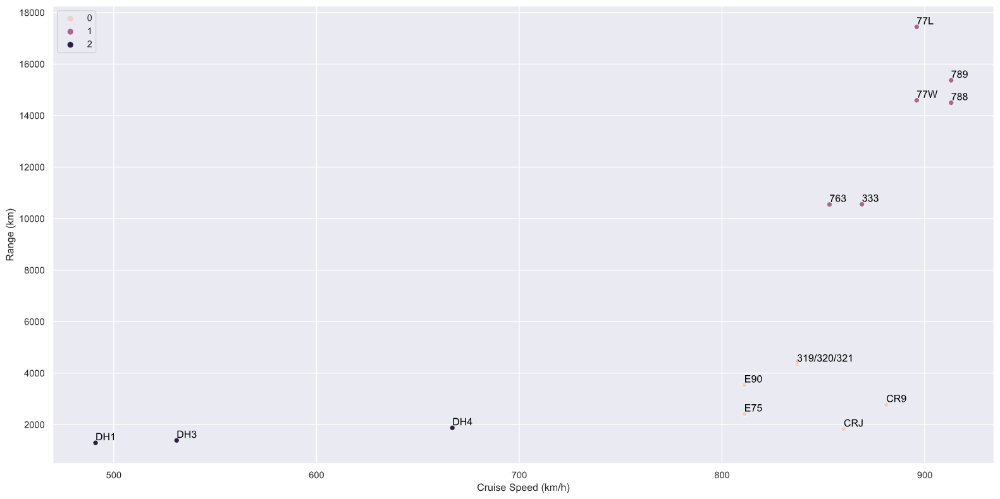

# AirCanada Flight Model

This repository contains the code to train the following models:
1. K-Means clustering model to group aircraft in AirCanada's fleet by capabilities
2. Random Forest Classification model which predicts the group of aicraft most suitable for each flight route

These two models are used to built a predictor which identifies the aircraft models that would be most suitable to serve a new route.

## K-Means Clustering Model
The training code and datasets are found in the `cluster/` directory. The final model uses 3 clusters and can be visualized using the figure below, which plots range versus speed (two of the features used in the clustering model) and colours the data points by cluster.



The fleet data is obtained from the **2021 AirCanada Timetable**: https://services.aircanada.com/portal/rest/timetable/pdf/ac-timetable-en.pdf?locale=en&app_key=AE919FDCC80311DF9BABC975DFD72085


## Random Forest Classifier Model
The training code and datasets are found in the `classify/` directory. New predictions can be made using the `predict_aircraft_type()` function in `predict_aircraft_type.py`:

```python
# Here we will predict which aircraft models should be used for a new route between
# Toronto (YYZ) and Seattle (SEA)

>>> from predict_aircraft_type import predict_aircraft_type

# load our aicraft model to class id map
>>> with open('cluster/identifiers_to_cat.p', 'rb') as f:
...      aircraft_id_to_class_map = pickle.load(f)

>>> predict_aircraft_type(
        model_path='aircraft_type_predictor.p',
        dest_airport_code='SEA',
        aircraft_identifier_map=aircraft_id_to_class_map,
        n_days_with_flights=7
    )

# the model has predicted that one of the long haul models should be used
['77W', '77L', '333', '789', '788', '763']
```

The route data is obtained from the **2021 AirCanada Timetable**: https://services.aircanada.com/portal/rest/timetable/pdf/ac-timetable-en.pdf?locale=en&app_key=AE919FDCC80311DF9BABC975DFD72085

The airport coordinates data is obtained from **OpenFlights.org**: https://raw.githubusercontent.com/jpatokal/openflights/master/data/airports.dat
